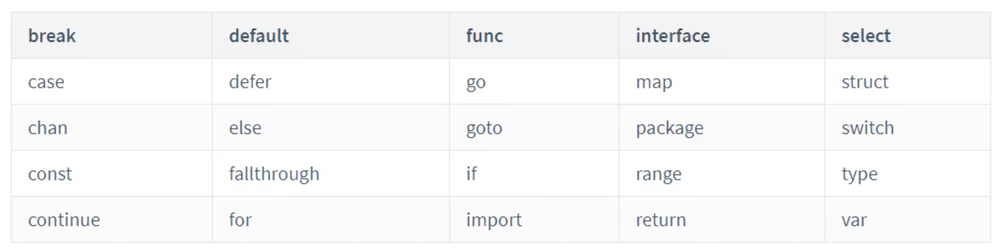
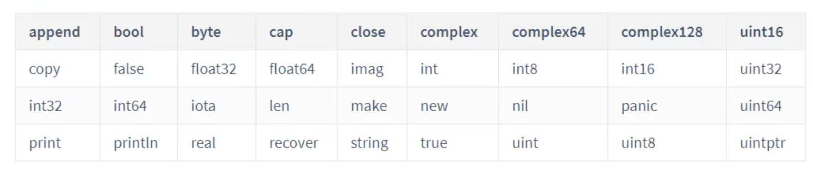

- [创建GoProject](#创建goproject)
	- [1 新建文件夹](#1-新建文件夹)
	- [2 初始化Go项目](#2-初始化go项目)
	- [3 新建Go包](#3-新建go包)
	- [4 关键字和变量名](#4-关键字和变量名)
		- [4.1 标识符](#41-标识符)
		- [4.2 关键字](#42-关键字)
		- [4.3 命名规范](#43-命名规范)
	- [5 Go变量](#5-go变量)
	- [6 Go常量](#6-go常量)
		- [iota关键字](#iota关键字)
	- [7 Go数据类型](#7-go数据类型)
		- [7.1 布尔型](#71-布尔型)
		- [7.2 字符串类型](#72-字符串类型)
		- [7.3 数字类型](#73-数字类型)
			- [7.3.1 整数](#731-整数)
			- [7.3.2 无符号整数](#732-无符号整数)
			- [7.3.3 浮点数](#733-浮点数)
		- [7.4 派生类型](#74-派生类型)
	- [8 Go格式化](#8-go格式化)
	- [9 运算符](#9-运算符)
		- [9.1 算术运算](#91-算术运算)
		- [9.2 逻辑运算](#92-逻辑运算)
		- [9.3 位运算](#93-位运算)
		- [9.4 关系运算](#94-关系运算)
		- [9.5 赋值运算](#95-赋值运算)
	- [10 Go流程控制](#10-go流程控制)
		- [10.1 if/else语句](#101-ifelse语句)
		- [10.2 switch语句](#102-switch语句)
		- [10.3 for循环](#103-for循环)
		- [10.4 控制循环关键字](#104-控制循环关键字)
	- [11 GO数组](#11-go数组)
	- [12 GO切片](#12-go切片)
	- [13、GO map](#13go-map)
	- [14、GO函数](#14go函数)
# 创建GoProject

## 1 新建文件夹

> mkdir GoPro

## 2 初始化Go项目

> go mod init GoPro

## 3 新建Go包

> package user

## 4 关键字和变量名

### 4.1 标识符

* 1只能以字母和下划线开头
* 2区分大小写
* 3由数字字母下划线组成

### 4.2 关键字




### 4.3 命名规范

* 包名称小写
* 文件名小写加下划线
* 结构体采用驼峰命名法
* 接口名单个函数接口名用er结尾
* 变量命名采用驼峰命名法
* 常量采用大写命名
  
## 5 Go变量

Go声明的变量必须使用
使用关键字var声明变量

```Go
//定义语法
var name string
var age int
var prompt bool

//另一种方法
var (
    name string
    age int 
    prompt bool
)

//变量的初始化
var name string = "mark"
var age int = 18

//类型推断
var age = 19
var name = "puma"

//初始化多个变量
var namn, age, tough = "wang", 18, true

//短函数声明 := ，只能使用在函数内部，函数外部不能使用
func main() {
    name := "wang"
    age := 18
}

//匿名变量
func getNameAge(string, int){
    return "Tom", 18
}
```

## 6 Go常量

使用关键字const

```Go
//声明常量语法
const constName [type] = value
//声明常量
const PI float32 = 3.1415
//初始化多个常量
const (
    a = 1
    b = 2
    c = 3
)
```

### iota关键字

> iota关键字是可被编译器修改的常量，默认值为0，每调用一次增1，遇到const关键字重置为0

```Go
func main() {
    const (
        a = iota//0
        b = iota//1
        c = iota//2
    )
}
//使用下划线跳过值
func main(){
    const() {
        a = iota//0
        b = iota//1
        _ //2
        c = iota//3
    }
}
//中间插入值和跳过相同
func main(){
    const() {
        a = iota//0
        b = 100
        c = iota//1
    }
}
```

## 7 Go数据类型

### 7.1 布尔型

> true 或者 false，常用在条件判断、逻辑表达式和循环语句上

```Go
func main() {
    //声明bool变量
    var a bool = true
    var b = false
    //短函数声明
    c := true
    d := false
}
```

### 7.2 字符串类型

```Go
//定义字符串
var a string = "hello"
var b = "world"
c := "hello world"
//打印字符串
fmt.Println("%s,%s,%v", a, b, c)
//字符串拼接
//1、使用加号拼接
d := a + b
//2、使用Sprintf函数拼接
e := fmt.Sprintf("%s, %s", a, b)
//3、使用bytes.Buffer拼接
var buffer = bytes.Buffer{}
buffer.WriteString(a)
buffer.WriteString(b)
fmt.Printf("%s", buffer.String())
//使用strings.Join拼接
var join = strings.Join([]string(a, b), "-")
fmt.Println("%s", join)
```

转义符 | 含义
--- | ---
\n | 换行
\t | 制表符
\r | 回车符
\\ | 反斜杠
\' | 单引号
\" | 双引号

```Go
//字符串切片
func main() {
    var a = "Hello,World"
    //返回0到5
    s1 := a[0:5]
    //返回5到结束
    s2 := a[5:]
    //返回5之前的
    s3 := a[:5]
    //字符串函数
    //返回字符串长度
    len := strings.len(a)
    //将字符串转换为大写
    upper := strings.ToUpper(a)
    //将字符串转换为小写
    lower := strings.ToLower(a)
    //判断字符串中是否包含某个字符串
    contains := strings.contains(a, "ll")//return true
    //判断字符串是否以某个字符串开头
    startWith := strings.HasPrefix(a, "H")//return true
    //判断字符串是否以某个字符串结尾
    endWith := strings.HasSuffix(a, "!")//return false
    //分割字符串
    split := strings.Split(a, ",")//return [Hello World]
    //替换字符串
    replace := strings.Replace("%v\n", strings.Replace(a, "o", "G", -1))
    //查找字符串，并返回第一个匹配的位置，没有返回-1
    index := strings.Index(a, "o")//return 4
    //查找字符串，并返回最后一个匹配的位置，没有返回-1
    lastIndex := strings.LastIndex(a, "o")//return 7
}
```

### 7.3 数字类型

> 支持整型和浮点型

#### 7.3.1 整数

默认为0

* int8
* int16
* int32
* int64

```Go
var i8 int8
var i16 int16
var i32 int32
var i64 int64
//类型，大小，最小值，最大值
fmt.Printf("%T %dB %v~%v\n", i8, unsafe.Sizeof(i8), math.MinInt8, math.MaxInt8)
fmt.Printf("%T %dB %v~%v\n", i16, unsafe.Sizeof(i16), math.MinInt16, math.MaxInt16)
fmt.Printf("%T %dB %v~%v\n", i32, unsafe.Sizeof(i32), math.MinInt32, math.MaxInt32)
fmt.Printf("%T %dB %v~%v\n", i64, unsafe.Sizeof(i64), math.MinInt64, math.MaxInt64)
//进制
func main() {
    var a int = 10
	fmt.Printf("%d\n", a)//十进制
	fmt.Printf("%b\n", a)//二进制
	fmt.Printf("%o\n", a)//八进制
	fmt.Printf("%x\n", a)//十六进制
}
```

#### 7.3.2 无符号整数

* uint8
* uint16
* uint32
* uint64

#### 7.3.3 浮点数

默认为0.0

* float32
* float64

### 7.4 派生类型

## 8 Go格式化

格式|含义
---|---
%v |变量
%T | 类型
%t |布尔值
%d | 整数
%b |二进制
%o | 八进制
%x | 十六进制
%p | 指针
%f | 浮点数

## 9 运算符

### 9.1 算术运算

```Go
var a int = 100
var b int = 5

//算术运算符
fmt.Printf("a + b = %d\n", a + b)
fmt.Printf("a - b = %d\n", a - b)
fmt.Printf("a * b = %d\n", a * b)
fmt.Printf("a / b = %d\n", a / b)
fmt.Printf("a mod b = %d\n", a % b)

//Go语言中++、--不能用作表达式中
a++
fmt.Printf("a++ = %d\n", a)
a--
fmt.Printf("a-- = %d\n\n", a)
```

### 9.2 逻辑运算

```Go
//逻辑运算符
flag1 := true
flag2 := false
judge = flag1 && flag2
fmt.Printf("flag1 && flag2 为 %t\n", judge)
judge = flag1 || flag2
fmt.Printf("flag1 || flag2 为 %t\n", judge)
judge = !flag1
fmt.Printf("!flag1 为 %t\n\n", judge)
```

### 9.3 位运算

```Go
var c int = 4//0100
var d int = 8//1000

fmt.Printf("c = %b \nd = %b\n", c, d)
result := c & d
fmt.Printf("c & d = %b\n", result)//两个都为1的位置为1，否则为0
result =  c | d
fmt.Printf("c | d = %b\n", result)//有一个位置为1，则为1，否则为0
result = c ^ d
fmt.Printf("c ^ d = %b\n", result)//两个位置不同为1，否则为0
result = c << 2
fmt.Printf("c << 2 = %b\n", result)//左移2位
result = c >> 2
fmt.Printf("c >> 2 = %b\n\n", result)//右移2位
```

### 9.4 关系运算

```Go
//关系运算符
var a int = 100
var b int = 5

judge := a == b
fmt.Printf("a == b 为 %t\n", judge)
judge = a != b
fmt.Printf("a != b 为 %t\n", judge)
judge = a > b
fmt.Printf("a > b 为 %t\n", judge)
judge = a < b
fmt.Printf("a < b 为 %t\n", judge)
judge = a >= b
fmt.Printf("a >= b 为 %t\n", judge)
judge = a <= b
fmt.Printf("a <= b 为 %t\n\n", judge)
```

### 9.5 赋值运算

```Go
a += 100
fmt.Printf("a += 5 = %d\n", a)
```

## 10 Go流程控制

### 10.1 if/else语句

```Go
//if语句格式
if 布尔表达式   {
    //语句
} else {
    //语句
}
```

注意点：

* 1.if语句中的布尔表达式只能是布尔值，不能是数值，不能用0或1来表示布尔值
* 2.布尔表达式不需要使用括号
* 3.可以在布尔表达式中声明变量，但需要注意变量作用域
* 4.大括号必须有，而且左括号必须跟在if和else之后

### 10.2 switch语句

```G0
switch grade {
	//单条件匹配
	case "A":
		fmt.Println("优秀")
	case "B":
		fmt.Println("良好")
        fallthrough 
	case "C":
		fmt.Println("一般")
	//多条件匹配
	case "D","E","F","G","H":
		fmt.Println("不及格")
	default:
		fmt.Println("还行")
	}
```

注意点：

* 1.switch支持多条件匹配
* 2.switch条件支持常量、变量、表达式
* 3.switch没有break语句
* 4.fallthrough关键字跳过下一个cases

### 10.3 for循环

Go可以使用for range循环遍历数组，map，切片，字符串，通道

* 数组、切片、字符串返回索引和数值
* map返回键和值
* 通道返回值和索引

```Go
//for格式
for 初始语句; 条件表达式; 循环语句 {
	    //循环体语句
	}
```

```Go
//for range格式
    for i, v := range array {
        fmt.Println("array[%d] = %d\n", i, v)

    }
```

### 10.4 控制循环关键字

1、 break

```Go
//break结束语句，可以使用在for、switch、select中
func r1() {
	//在for循环中使用break语句
	i := 0
	for i <= 10 {
		fmt.Printf("%d\n", i)
		i++
		if i >= 6 {
			break
		}
	}
	fmt.Println()
}
```

2、continue

```Go
//continue跳过语句，跳过当前执行内容
func g2() {
	for i := 0; i <= 10; i++ {
		END:
		for j := 0; j <= 10; j++ {
			fmt.Printf("%d , %d\n", i, j)
			if i == 6 && j == 6 {
				continue END
			}
		}
	}
}
```

3、goto

```Go
//goto强制跳转语句，跳转到指定标签处
func v1() {
	for i := 0; i <= 10; i++ {
		if i % 2 == 0 {
			fmt.Printf("%d\n", i)
		}else {
			goto END
		}
	}
	END:
		fmt.Println("ENDINGs....")
}
```

## 11 GO数组

> 数组是相同数据类型元素的集合，可以通过索引来进行访问数组元素，一旦定义数组，长度不能修改

```Go
//数组定义
//var 数组名称 [数组成都]数据类型
func array2() {
	//初始化数组,指定长度
	var a = [3]int{2, 4, 5}
	var b = [2]string{"hello", "world"}
	var c = [2]bool{true, false}
	fmt.Printf("a: %v\n", a)
	fmt.Printf("b: %v\n", b)
	fmt.Printf("c: %v\n", c)
}
func array6() {
	//通过索引来访问数组元素
	var a [3]int
	a[0] = 100
	a[1] = 200
	a[2] = 400
	fmt.Printf("a: %v\n", a)
}
func array7() {
	//根据数组长度遍历数组,len(a)
	var a = [...]int{1,2,3,4,5,6,67,43}
	for i := 0; i < len(a); i++ {
		fmt.Printf("a[%v] = %v\n", i, a[i])
	}
}
```

## 12 GO切片

> 可变长度的数组，底层使用数组实现，增加了自动扩容功能。解决了生命数组时过大占用内存，过小不够使用的问题。

```Go
//声明切片,不需要指定长度
//var slice []int
//直接初始化切片
var a = []int{1,2,3,4,5,6}
fmt.Printf("%v\n", a)
//切片的切片,取0但不取3
b := a[0:3]
fmt.Printf("%v\n", b)
//根据索引和长度遍历切片
var a = []int{1,2,3,4,5,6,7,8,9,0}
length := len(a)
for i := 0; i < length; i++ {
	fmt.Printf("a[%v]=%v\n", i, a[i])
}
//通过for range遍历切片
var a = []int{1,2,4,5,6,7,8,9,0}
for i, v := range a {
	fmt.Printf("a[%v]=%v\n", i, v)
}
//使用append()函数向切片中添加元素
var a = []int{}
a = append(a, 100)
//删除切片中的元素
var a = []int{1,2,3,4,5,6,7,8,9,0}
//删除第一个元素
a = append(a[:0], a[1:]...)
//更新切片中的元素
var a = []int{1,2,3,4,5,6,7,8,9}
a[4] = 1000
//查询切片中的元素
var a = []int{1,2,3,4,5,6,7,8,9,0}
key := 4
for i, v := range a {
	if i == key {
		fmt.Printf("a[%v] = %v\n", i, v)
	}
}
//赋值切片会赋值切片的地址，修改其中一个切片，另一个切片也会被
var a = []int{1,2,3,4,5}
var b = a
fmt.Printf("a: %v\n", a)
fmt.Printf("b: %v\n", b)
b[2] = 500
fmt.Println("------------------")
fmt.Printf("a: %v\n", a)
fmt.Printf("b: %v\n", b)
//使用copy(目标切片，源切片)函数复制切片
var a = []int{1,2,3,4,5,6}
var b = make([]int, len(a))
copy(b, a)
fmt.Printf("a: %v\n", a)
fmt.Printf("b: %v\n", b)
```

## 13、GO map

> 一种键值对数据结构的容器，实现了哈希表，可以通过key来进行查询，map是引用类型。

```Go
//使用map关键字声明map语法
//var mapName map[keyType]valueType
//使用make函数声明map
//var mapName = make(map[keyType]valueType])

//直接初始化
var john = map[string]string{
	"name":"john",
	"age":"25",
	"job":"skate",
}
fmt.Printf("john: %v\n", john)

//使用make初始化
yuri := make(map[string]string)
yuri["name"] = "yuri"
yuri["age"] = "24"
yuri["job"] = "doctor"
fmt.Printf("yuri: %v\n", yuri)

//Access to map elements using a key
maps := make(map[string]string)
maps["name"] = "kimi"
maps["age"] = "41"
maps["job"] = "driver"
var key = "job"
var value = maps[key]
fmt.Printf("%v : %v\n", key, value)

//determine whether a map contains a cert
//value, ok := mapName[key]
var maps = make(map[string]string)
maps["name"] = "kimi"
maps["age"] = "41"
maps["job"] = "driver"
var key1 = "age"
var key2 = "email"
v, ok := maps[key1]
fmt.Printf("v : %v, ok : %v\n", v, ok)
v, ok = maps[key2]
fmt.Printf("v : %v, ok : %v\n", v, ok)

//ergodic map elements using range loop 
var maps = make(map[string]string)
maps["name"] = "kimi"
maps["age"] = "41"
maps["job"] = "driver"
maps["award"] = "gold"
for key, value := range maps {
	fmt.Printf("%v : %v\n", key, value)
```

## 14、GO函数

1. 函数不允许重载，不能重名
2. 函数不能嵌套
3. 函数可以作为返回值返回
4. 函数可以作为参数传递
5. 函数参数可以无名
函数定义语法


```Go
func function_name(parameter_list) return_value {
	//function_body
}
```


